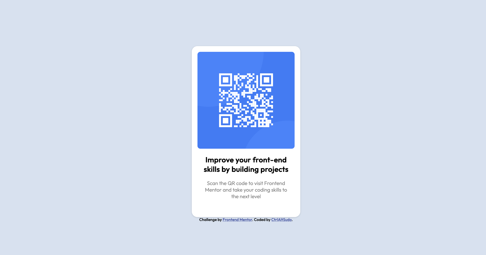

<h1 align="center">QR code component</h1>

 <a align="center" href="https://ctrlaltsudo.github.io/FM-QR-code-component">Live Demo</a>

|

 <a align="center" href="https://www.frontendmentor.io/solutions/qr-code-component-nx6KPrVhLl">Solution Page</a>

  </img>

# Project Title

QR code component

## Description

This is a responsive QC code card challenge by Frontend Mentor, Frontend Mentor is a website that provides various web development challenges to help you develop your coding skills.

## Built with 

HTML 
CSS
Flexbox 

## Authors

<a href="https://github.com/CtrlAltSudo">CtrlAltSudo</a>.

## Acknowledgments

I love that Frontend Mentor exists, I'm not sure I would be learning as much in my free time without it. 